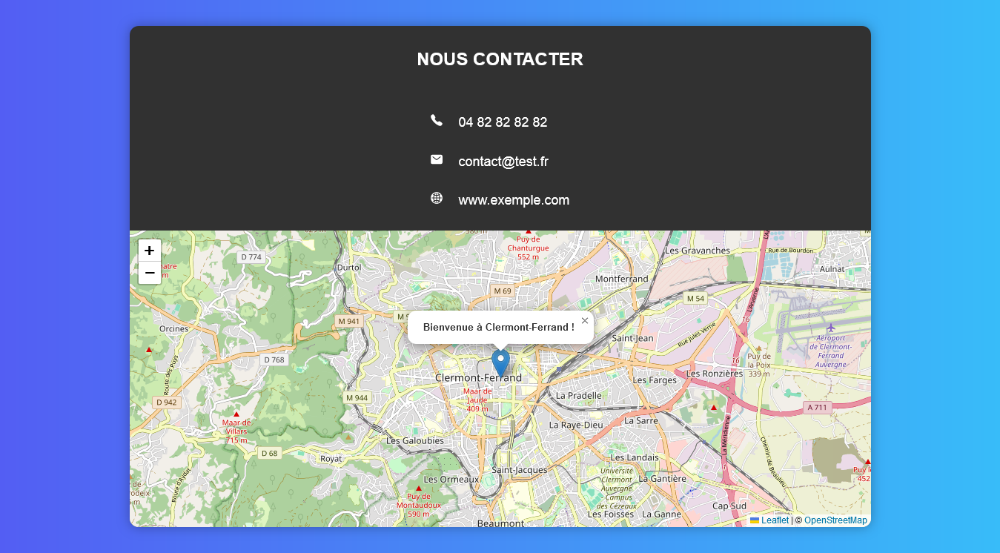

## INFORMATION DE CONTACT ET CARTE GEOGRAPHIQUE

## Le challenge

Mon objectif a été de créér une zone de contact contenant des liens cliquables et une carte géographique à l'aide de l'API Leaflet. Pour se faire, j'ai ajouté :

- trois liens cliquables
- une carte via l'API Leaflet et www.openstreetmap.org
- Possibilité de zoomer et/ou dézoomer
- un marqueur sur la carte
- et une popup

## Démonstration

Lien vers le projet : https://aperbet56.github.io/information_contact_et_carte_geographique/

## Projet développé avec

- Utilisation des balises sémantiques HTML5
- CSS
- Flexbox
- JavaScript
- Code commenté en JavaScript
- API LEAFLET
- Page web responsive
